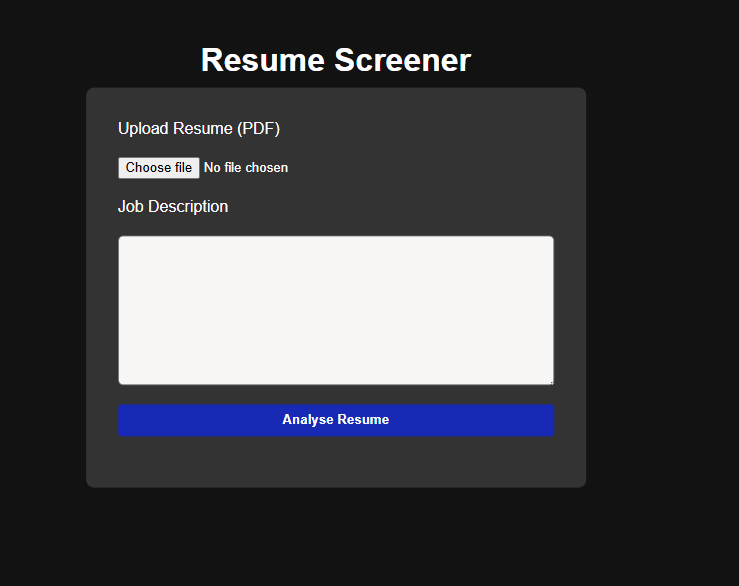
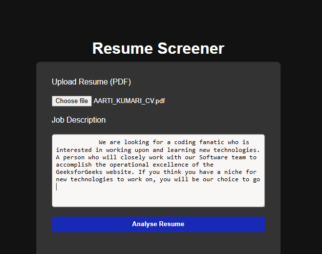
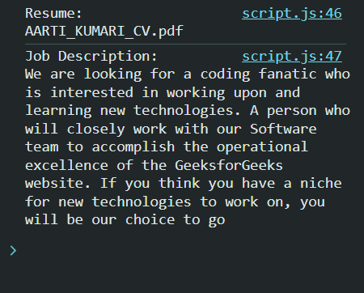
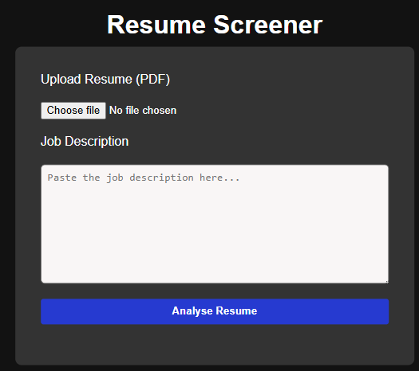
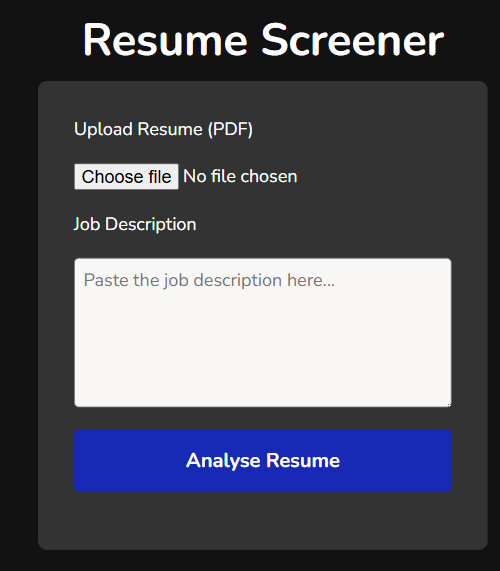
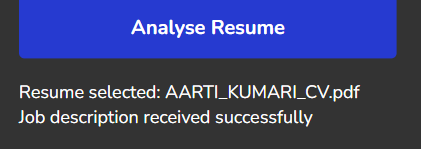
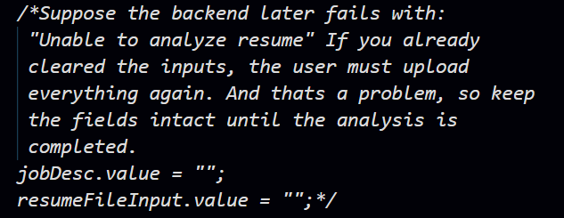

# Resume-Screener

> At first I am working on building a MVP(Minimal Viable Product)

---

I recently finished my Sprint 1 of the Project requirments where -
- 
- Checked for the input type file and text area for the uploaded resume and job description showed them on the console

### Here are some screenshots
### Initially




### After uploading file and jd



### console on clicking the analyse button



### After refresh



> Sprint completed

### Some Changes which I wish to bring:
- Increase font-size --> Increased font size

- Change the font, as the textarea content looks like old typer machine typed, I mean I dont like it --> I changed it to Nunito a Google Font


- When I am trying to set the font size from universal selector and from body I see different behaviour, why is it so? How can I change the font everywhere --> Understood! universal selector was selecting every single element and changing the font and thus the heading, we can seperately resize the heading

- Also I faced problem finding out what happens with the padding for input elements --> I saw that for the button


> The placeholder is only visible after I have pasted some text and then analyse button clicked.. Why its not showing up initially?
- Got to know the reason behind it, in html I wrote the textarea tag like: 
``` html 
  <textarea name="Job Desc" id="jd-tarea" rows="5" cols="40" placeholder="Paste the job description here...">
  </textarea> 
  ``` 

  - In the above code linebreak was the problem, textarea tag was considering it a value and thus initally I saw those starting spaces.. now its resolved
  
  



# Sprint 2
### Replacing console-only feedback with UI feedback.
 
Successfully did it via setting textcontent of resultShowcase dom element

```
    analyseResumeBtn.addEventListener('click', (e) => {
        e.preventDefault();
        const resume = resumeFileInput.files[0];
        const jd = jobDesc.value;

        if(!resume){
            resultShowcase.textContent = "Please select a resume";
            return;
        }
        if(jd.trim() === ""){
            resultShowcase.textContent = "Please paste a job description";
            return;
        }
        // resultShowcase.textContent = `Resume selected: ${resume.name}\nJob description received successfully`;
        resultShowcase.innerHTML = `Resume selected: ${resume.name}<br>Job description received successfully`;

        jobDesc.value = "";
        resumeFileInput.value = "";

    })
```

But textcontent flushes out nextline and thus I was unable to see it


Changed to innerHTML with <br>

Finally saw a next line

Some changes
