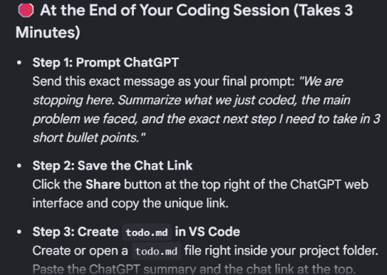
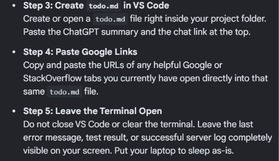
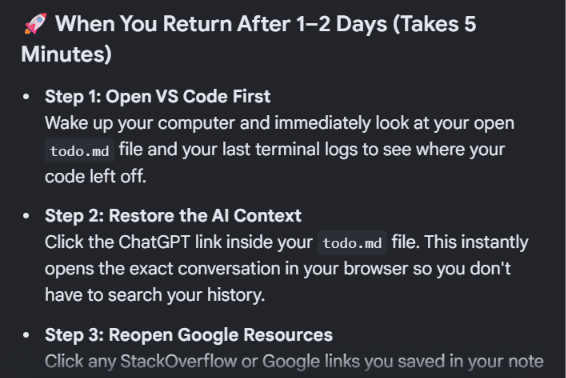
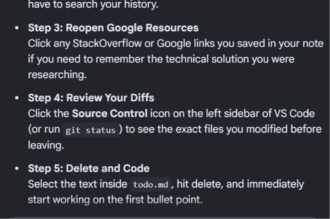
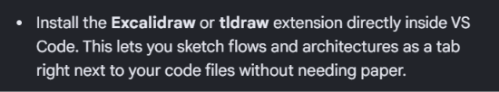
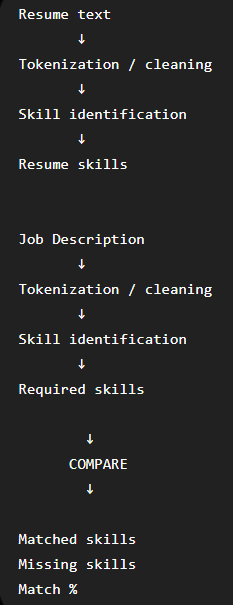
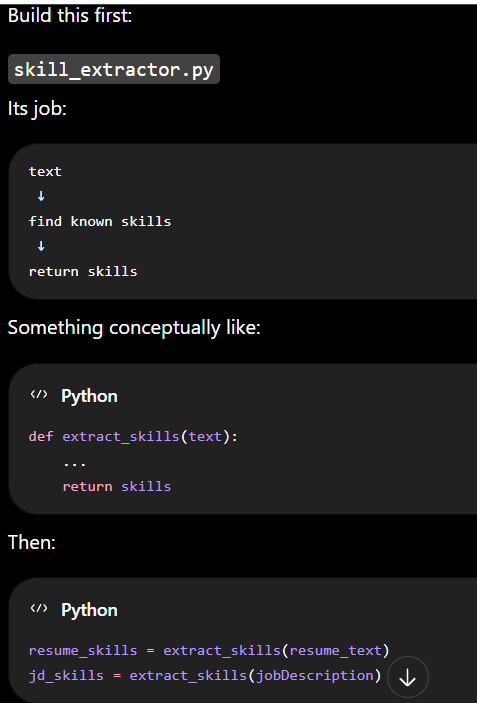
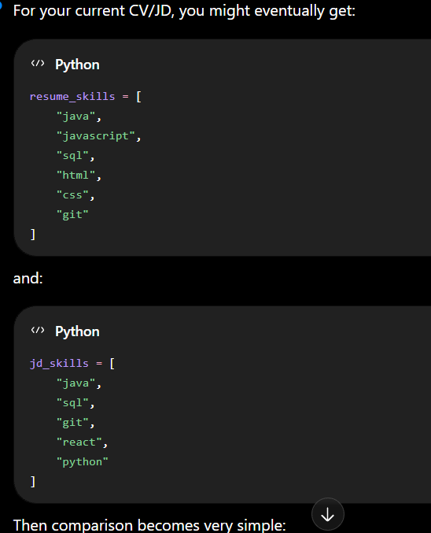
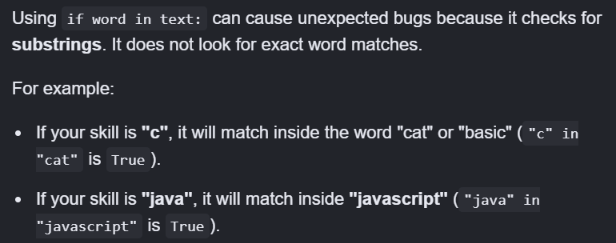

https://share.google/aimode/Zxif2SMYp5DXmQRwY






3rd https://share.google/aimode/yhNALprpXmXT5P4dR

2nd https://share.google/aimode/uzkGISGjyrcVw5QFK

1st  https://share.google/aimode/AAZbRitUOcFbyoCcX


### Refer to this for Project topic discussion
https://chatgpt.com/s/t_6aaed933d79c8191845c299cc88db66a

#### Install tldraw and learn about its features


## 21/09/26
### What I learnt?
https://share.google/aimode/v2LUhZ2Cog4k4bgBP

## What I did?
https://chatgpt.com/s/t_6ab0a14df59c8191b1a543c9e7361082

### Refer to below link for exact next steps I need to take
https://chatgpt.com/s/t_6ab58769bcac8191948e43260041d65b

### Summary of extracting skills
https://share.google/aimode/8c9j9dzunpdLNhYGD

https://share.google/aimode/ww4WQLQATVmh5gaW9

### How to convert of normal pdf to bytes. io stream
https://share.google/aimode/v2LUhZ2Cog4k4bgBP

### What I did till now?
PDF upload → FastAPI → parser.py → extracted resume text → analyzer.py → analysis object → JSON → frontend UI
``` 
What you accomplished today?
1. PDF parsing works — parser.py converts uploaded PDF bytes into text.
2. Backend integration works — main.py receives the file, calls the parser, then calls the analyzer.
3. Frontend integration works — script.js receives the JSON response and accesses nested values with data.analysis.resume_length  
```
Now we need to replace this in analyser 
```
{
    "resume_length": len(resume_text),
    "job_description_length": len(jobDescription)
}
```
with actual business logic.

### My thought process: 
- Extracting each word from the resume text and JD text, and then compare them
-  But many skills are multi-word terms also like machine learning,
data structures,
spring boot,
react native

### Our goal is not "What words occur in this resume?" instead
 ### "Which relevant skills appear in the resume and which skills are requested by the JD?"

## This structure was recommended


## how do we identify a "skill"?
- Initially by creating a skill vocabulary
- Like 
```
SKILLS = {
    "java",
    "javascript",
    "python",
    "sql",
    "html",
    "css",
    "react",
    "node.js",
    "fastapi",
    "git",
    "github",
    "mongodb",
    "mysql",
    "data structures",
    "machine learning",
    "natural language processing"
}
```
Then your analyzer can check whether these skills occur in the resume/JD.

This is called a rule-based / dictionary-based approach.





I got the doubt :
```
 for word in text:
        if word in skills:
            match_skills.add(word)
    return match_skills
```
Will it work if we replace skills with text?


